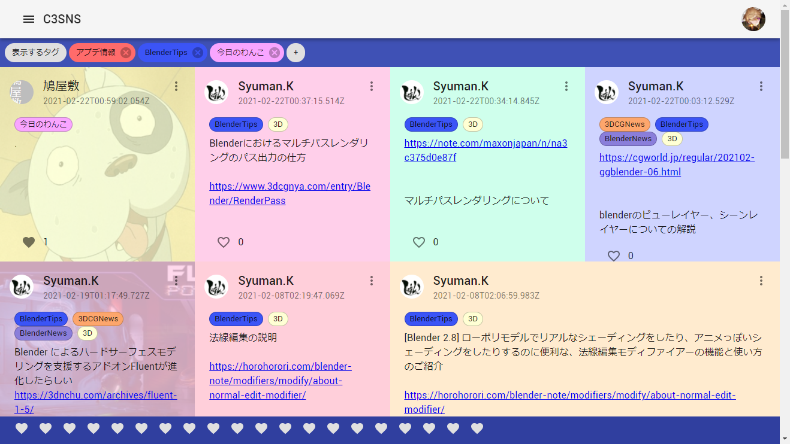

# Kyutositsu: Grid style Tag based SNS



## 特徴

### グリッドスタイルで高い画面効率
タイムライン形式ではなくグリッドスタイルで投稿を表示するため、無駄なタイムラインで画面が使われることがなく画面効率が高い。

### フォロー/フォロワーではなくタグで投稿を一覧でき、サークル、会社などの組織内SNSとして便利
組織内SNSであればユーザーを絞り込んで投稿を一覧するよりも、投稿内容についてのタグで絞り込むほうが便利であると考え、フォロ/フォロワーの代わりにタグで絞り込むシステムを採用。

### その他SNSとしての一般的機能
通知、いいね機能など基本的なSNSの機能を実装。

## 開発、運用
\* **現在Discordアカウントを利用したログインにのみ対応**
- ruby 2.6.6
- Bundler 2.1.4
- Node.js v12.18.4

### 環境変数
#### DiscordのOAuthキー発行
Discord DevelopersのサイトよりOAuthの認証情報を発行

#### `/.env`
```
REACT_APP_DISCORD_CLIENT_ID={DiscordのクライアントID}
REACT_APP_DISCORD_CLIENT_SECRET={Discordのクライアントシークレット}
REACT_APP_URL={デプロイ先URL(https://も含めて)}

# production環境の場合
DATABASE_URL={PostgreSQLのURL}
REDIS_URL={ActionCableに利用するRedisのURL}

# S3を使用する場合↓
ASSET_STORE_PROVIDER=AWS
AWS_ACCESS_KEY_ID={S3のアクセスキー}
AWS_SECRET_ACCESS_KEY={S3のシークレットアクセスキー}
AWS_REGION={S3のリージョン}
AWS_S3_BUCKET={S3のバケット名}
```

### バックエンド
```
$ rails db:migrate
$ rails server
```

### フロントエンド
```
$ cd frontend
$ yarn install
$ yarn build
```

## Contributor
### [rkun123](https://github.com/rkun123)
- Github: [@rkun123](https://github.com/rkun123)
- Twitter: [@rkunkunr](https://twitter.com/rkunkunr)